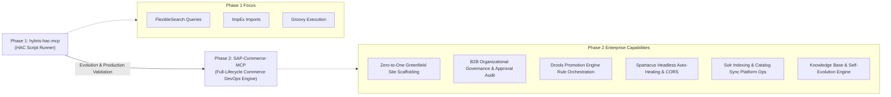

# SAP Commerce Cloud MCP Server (`SAP-Commerce-MCP`)

[](https://www.python.org/downloads/)
[](https://modelcontextprotocol.io/)
[](https://help.sap.com/docs/SAP_COMMERCE_CLOUD)
[](https://opensource.org/licenses/MIT)

[English](README.md) | [中文说明](README_ZH.md)

**SAP-Commerce-MCP** (`sap-commerce-mcp`) is an enterprise-grade Model Context Protocol (MCP) server that empowers AI assistants (Claude, Antigravity, Cursor, etc.) to directly control, automate, orchestrate, and self-heal **SAP Commerce Cloud (Hybris)** environments and **Headless Composable Storefronts (Spartacus)**.

Far beyond a basic Hybris Administration Console (HAC) bridge, it functions as a comprehensive Commerce Cloud Copilot with Greenfield site provisioning, B2B organizational governance, Drools promotion engine orchestration, headless Spartacus storefront diagnostics, Solr search indexing, catalog synchronization, and an agentic self-evolution engine.

---

## 📜 Evolution: From `hybris-hac-mcp` to Enterprise `SAP-Commerce-MCP`

> **Why do tool names keep the `hac_*` prefix?**
>
> This project originated as **`hybris-hac-mcp`**, a developer tool focused on executing FlexibleSearch queries and Groovy scripts through the Hybris Administration Console (HAC).
>
> In actual enterprise delivery, large-scale customer engagements (such as **Swire Coca-Cola HK eB2B** and **Mindray Global B2B**) required far more than low-level script execution. They demanded Greenfield site provisioning, B2B organizational approval chain governance, Drools promotion engine compilation, Solr real-time indexing, and headless Spartacus full-stack diagnostics.
>
> Therefore, the project was comprehensively upgraded to **`SAP-Commerce-MCP`**. To ensure **100% backward compatibility** with existing AI agents, prompts, and automation skills, all tool names strictly retain their `hac_*` prefixes, while their underlying implementations and domain capabilities have evolved into a complete, enterprise-grade Commerce DevOps engine.



---

## 🌟 Key Capabilities at a Glance

- 🏗️ **Zero-to-One Greenfield Provisioning**: Instant scaffolding of `BaseSite`, `BaseStore`, `ProductCatalog` (Staged & Online), Content Catalogs, Sync Jobs, Multi-currency, Multi-language (`zh_TW`, `en`, `zh_CN`), and OCC OAuth client credentials.
- 🩺 **Headless Spartacus Doctor & Auto-Healing**: Deep diagnostics for Composable Storefronts, detecting CORS whitelist gaps, OCC URL regex mismatches, OAuth client registrations, and CMS online status with one-click automated remediation.
- 🏢 **B2B Organization Governance**: Automated setup and validation of multi-tiered `B2BUnit` hierarchies, `B2BBudget`, `B2BCostCenter`, `B2BOrderThresholdPermission` approval limits, and demo buyer/approver personas.
- 🏷️ **Drools Promotion Engine Orchestration**: Code-free provisioning of B2B/B2C promotion rules (Spend Thresholds, Free Gifts, A+B+C Bundles, and Potential Promotion reminders) with automatic Drools rule compilation and publishing.
- ⚡ **Direct Hybris Runtime Control**: Seamless execution of FlexibleSearch queries (rendered as Markdown tables), transactional ImpEx imports with strict validation, and Groovy scripts executed live in the Hybris JVM container.
- 🔍 **Solr Indexing & Platform Ops**: In-process full/update Solr reindexing, cronjob monitoring, catalog synchronization, and Hybris Region Cache clearing.
- 🧠 **Self-Evolution & Proven Script Library**: Built-in script asset manager archiving verified Groovy/ImpEx scripts, domain knowledge base accumulating troubleshooting experience, and self-improving meta-tools.

---

## 🏢 Field-Tested Enterprise Case Studies

### 🥤 Case 1: Swire Coca-Cola HK (太古可口可乐香港) eB2B Beverage Portal
- **Challenge**: Deliver a brand-new eB2B beverage ordering platform for Hong Kong with 105 drink SKUs, 13 product lines, bilingual localization (Traditional Chinese `zh_TW` and English `en`), Drools beverage bundle promotions, and an Angular/Spartacus headless storefront.
- **SAP-Commerce-MCP in Action**:
  1. `hac_scaffold_greenfield_site`: Initialized `swire-beverages` BaseSite, dual product catalogs, and OCC OAuth clients in 15 seconds.
  2. `hac_impex_import`: Imported 105 beverage SKUs with multi-tier wholesale pricing and category mappings.
  3. `hac_groovy_execute`: Bound official S3 product imagery in bulk directly within the Hybris JVM container.
  4. `hac_promotion_scaffold`: Provisioned an A+B+C beverage bundle promo (Coke + Sprite + Fanta -> Free Monster Energy) with automatic Drools rule compilation.
  5. `hac_solr_reindex`: Executed full Solr reindexing to immediately expose all products in the search facet index.
  6. `hac_storefront_autofix`: Automatically configured CORS whitelisting and OCC URL patterns for Spartacus on port 4200.

### 🏥 Case 2: Mindray Global (迈瑞医疗) B2B Multi-Tier Approval & Cost Center Governance
- **Challenge**: Establish an enterprise medical device procurement hierarchy across global branches, enforcing multi-tier cost center budgets and order threshold approvals.
- **SAP-Commerce-MCP in Action**:
  1. `hac_b2b_scaffold_org`: Created Mindray Root Unit, Radiology and Surgical departments, designated Cost Centers, and assigned $50,000 budgets with dual-threshold approval rules.
  2. `hac_b2b_org_doctor`: Instantly analyzed and audited test buyer accounts, validating approval threshold triggers and cost center deduction chains before going live.

---

## 🏛️ Architecture Overview

```mermaid
flowchart TD
    subgraph AI_Agents ["AI Assistants & IDEs"]
        Agent[Claude / Antigravity / Cursor]
    end

    subgraph MCP_Server ["SAP-Commerce-MCP (sap-commerce-mcp)"]
        Server[MCP Server Core - JSON-RPC Stdio]
        HAC[HAC HTTP Client & CSRF Handler]
        SSO[Corporate SSO Authenticator]
        Scaffolder[Site & CMS Scaffolder]
        Doctor[Spartacus Doctor & AutoFix]
        B2B[B2B Org Governance]
        Promo[Drools Promotion Engine]
        Solr[Solr & Platform Ops]
        Crawler[Storefront Ingestion]
        SelfEvolve[Self-Evolution & Script Library]
    end

    subgraph Target_Environments ["SAP Commerce Cloud Ecosystem"]
        HybrisJVM["SAP Commerce Cloud (CCL 2211 / CCv2)\n- HAC & Web Services (OCC)\n- Drools Rule Engine\n- Solr Search Engine"]
        Storefront["Composable Storefront (Spartacus)\nAngular / SSR on Node.js"]
    end

    Agent <-->|MCP Protocol (JSON-RPC)| Server
    Server --> HAC
    Server --> SSO
    Server --> Scaffolder
    Server --> Doctor
    Server --> B2B
    Server --> Promo
    Server --> Solr
    Server --> Crawler
    Server --> SelfEvolve

    HAC <-->|HTTPS / Session / CSRF| HybrisJVM
    Doctor <-->|REST / DOM Probe| Storefront
```

---

## 🛠️ Complete Tool Suite (27 Tools)

### 1. HAC Core Runtime & Authentication (6 Tools)
| Tool Name | Key Parameters | Description |
| :--- | :--- | :--- |
| `hac_configure` | `hac_url`, `username`, `password`, `storage_path` | Dynamically configures the target Commerce Cloud instance URL, credentials, and session cache path. |
| `hac_status` | *(None)* | Checks connection health, active credentials, session validity, and CSRF token status. |
| `hac_sso_login` | *(None)* | Launches an interactive browser session to handle corporate SSO (SAP Identity / Microsoft Entra) and caches the session cookie. |
| `hac_flexsearch` | `query`, `max_count` | Executes FlexibleSearch queries and formats tabular output directly into Markdown. |
| `hac_impex_import` | `script`, `max_threads`, `validation_mode` | Imports ImpEx scripts with strict/relaxed validation and detailed error reporting. |
| `hac_groovy_execute` | `script`, `commit` | Executes Groovy scripts directly inside the Commerce Cloud JVM container. |

### 2. Greenfield Site Provisioning & CMS Orchestration (4 Tools)
| Tool Name | Key Parameters | Description |
| :--- | :--- | :--- |
| `hac_scaffold_greenfield_site` | `site_id`, `site_name`, `catalog_id`, `currencies`, `languages` | Fully automates new site creation: BaseSite, BaseStore, Catalogs (Staged & Online), Sync Jobs, Currencies, Languages, OCC URL regex, and trusted OAuth clients. |
| `hac_site_list` | *(None)* | Lists all configured `BaseSite` models, channels, stores, and catalog linkages. |
| `hac_storefront_cms_scaffold` | `site_id`, `page_title`, `banner_url` | Scaffolds responsive homepage CMS structures (banners, carousels, responsive navigation nodes). |
| `hac_storefront_app_config` | `site_id`, `occ_base_url`, `storefront_dir` | Generates or writes ready-to-use Spartacus `spartacus-configuration.module.ts` code. |

### 3. Headless Spartacus Diagnostics & Auto-Healing (2 Tools)
| Tool Name | Key Parameters | Description |
| :--- | :--- | :--- |
| `hac_spartacus_doctor` | `storefront_url`, `base_site_id` | Comprehensive headless storefront health check: BaseSite existence, OCC URL regex patterns, CORS allowed origins, OAuth client registration, and Homepage CMS status. |
| `hac_storefront_autofix` | `site_id`, `storefront_origin`, `enable_cors`, `register_oauth` | Automatically remediates identified Spartacus/OCC bottlenecks (CORS whitelisting, OAuth registration, staged-to-online CMS publishing). |

### 4. B2B Organization Hierarchy & Governance (2 Tools)
| Tool Name | Key Parameters | Description |
| :--- | :--- | :--- |
| `hac_b2b_scaffold_org` | `root_unit_id`, `cost_center_id`, `budget_amount`, `currency` | Scaffolds enterprise B2B customer hierarchy: Root Unit, sub-departments, Cost Centers, Budgets, Approval Thresholds, and Buyer/Approver demo accounts. |
| `hac_b2b_org_doctor` | `user_id` | In-depth audit of a B2B user: Unit hierarchy, assigned cost centers, approval chains, user groups, and checkout authorizations. |

### 5. Drools Promotion Engine Orchestration (2 Tools)
| Tool Name | Key Parameters | Description |
| :--- | :--- | :--- |
| `hac_promotion_scaffold` | `rule_code`, `rule_name`, `promotion_type`, `promotion_group`, `rule_params` | Automates Drools promotion rules: Order Total Threshold discounts, Buy X Get Y Free Gifts, Multi-Product Bundles (A+B+C), and Potential Promotion reminders. |
| `hac_promotion_list` | `promotion_group`, `status` | Lists and filters active `PromotionSourceRule` models across modules, displaying priority, status, and triggers. |

### 6. Solr Search, Catalog Sync & Platform Ops (5 Tools)
| Tool Name | Key Parameters | Description |
| :--- | :--- | :--- |
| `hac_solr_reindex` | `facet_search_config`, `indexed_type`, `full_reindex` | Triggers in-process full or incremental Solr reindexing for target facet search configurations. |
| `hac_solr_status` | `cronjob_code` | Queries the status and duration of running Solr indexer cronjobs. |
| `hac_catalog_sync` | `catalog_id`, `source_version`, `target_version` | Triggers catalog version synchronization jobs (`Staged` -> `Online`). |
| `hac_cache_clear` | *(None)* | Clears the Hybris Region Cache in memory. |
| `hac_check_i18n_completeness` | `catalog_id`, `catalog_version`, `required_langs` | Audits localization completeness across product catalogs (detects missing translations in `zh_TW`, `en`, `zh_CN`). |

### 7. External Ingestion, Script Library & Self-Evolution (6 Tools)
| Tool Name | Key Parameters | Description |
| :--- | :--- | :--- |
| `hac_ingest_external_storefront` | `source_url`, `catalog_id`, `max_products` | Crawls external e-commerce sites (Shopify, WooCommerce, Magento) to extract products and generate Hybris-compatible ImpEx. |
| `hac_library_list` | `category` | Browses the local repository of proven, verified Groovy and ImpEx scripts. |
| `hac_library_get` | `script_id` | Retrieves the full content of an archived script by identifier. |
| `hac_self_diagnose` | *(None)* | Performs self-diagnostics on the MCP server itself (module health, script library count, knowledge base rules). |
| `hac_self_improve` | `improvement_type`, `target_name`, `code_or_config` | Enhances server capability and internalizes new operational tools. |
| `hac_record_learning` | `title`, `category`, `problem`, `solution`, `keywords` | Persists domain knowledge, error patterns, and troubleshooting rules into `knowledge_base.json`. |

---

## 🚀 10-Second Quick Start

Thanks to modern Python packaging with `pyproject.toml`, you do **not** need to manually clone, build, or configure Python virtual environments. You can run the server directly via `uvx`.

### Method 1: Zero-Install with `uvx` (Recommended)

#### Option A: One-line setup with Claude CLI
```bash
claude mcp add sap-commerce-mcp -- uvx --from git+https://github.com/chriszhangrui/sap-commerce-mcp.git sap-commerce-mcp
```

#### Option B: Configure in Claude Desktop (`claude_desktop_config.json`)
```json
{
  "mcpServers": {
    "sap-commerce-mcp": {
      "command": "uvx",
      "args": [
        "--from",
        "git+https://github.com/chriszhangrui/sap-commerce-mcp.git",
        "sap-commerce-mcp"
      ],
      "env": {
        "HAC_URL": "https://localhost:9002",
        "HAC_USER": "admin",
        "HAC_PASS": "nimda"
      }
    }
  }
}
```

#### Option C: Configure in Antigravity / Gemini CLI (`mcp_config.json`)
```json
{
  "mcpServers": {
    "sap-commerce-mcp": {
      "command": "uvx",
      "args": [
        "--from",
        "git+https://github.com/chriszhangrui/sap-commerce-mcp.git",
        "sap-commerce-mcp"
      ]
    }
  }
}
```

---

### Method 2: Local Development / Manual Git Clone

For local MCP development or custom script additions:

```bash
# 1. Clone repo
git clone https://github.com/chriszhangrui/sap-commerce-mcp.git
cd sap-commerce-mcp

# 2. Create and activate venv
python3 -m venv venv
source venv/bin/activate

# 3. Install in editable mode
pip install -e .

# 4. Run test suite
python test_server.py
```

Expected verification output:
```text
✓ Initialize: sap-commerce-mcp
✓ Registered tools count: 27
✓ Self-Diagnose Preview: 🟢 核心模块全部正常就绪
...
🎉 ALL 27 MCP TOOLS OPERATIONAL & VERIFIED OVER JSON-RPC STDIO!
```

---

## 💡 Example Prompt Scenarios

Once connected, your AI assistant can execute complex Commerce tasks directly from natural language:

### Scenario 1: Greenfield B2B Storefront Scaffolding
> *"Scaffold a new B2B site called `swire-beverages` with currency HKD and USD, languages zh_TW and en, link it to powertools catalogs, and verify Spartacus headless readiness."*

### Scenario 2: Drools Promotion Orchestration
> *"Create an A+B+C sparkling beverage bundle promotion in the powertoolsPromoGrp module: when a customer buys Coke, Sprite, and Fanta together, gift them 1 case of Monster Energy. Ensure the message is localized in English and Traditional Chinese."*

### Scenario 3: B2B Organization & Approval Flow Diagnosis
> *"Run an audit on B2B buyer `buyer.mindray_global@demo.com`. Why is their checkout order being held for approval? Check their cost center and approval threshold."*

### Scenario 4: Live Data Inspection
> *"Execute a FlexibleSearch to list the top 10 products in powertoolsProductCatalog Online version ordered by creation time."*

---

## 📚 Best Practices & Troubleshooting

Accumulated from field engagements and embedded in `knowledge_base.json`:

1. **CSRF Token Handling**: Commerce Cloud 2211 requires strict CSRF verification for all POST requests. `SAP-Commerce-MCP` automatically fetches and refreshes CSRF tokens alongside session cookies on every request.
2. **Drools Promotion Publication**: After creating a `PromotionSourceRule`, it must be compiled into a runtime rule. `hac_promotion_scaffold` triggers the Promotion Engine compilation job automatically.
3. **Solr Index Updates**: After bulk-updating product categories or imagery via Groovy/ImpEx, always invoke `hac_solr_reindex(full_reindex=False)` to synchronize search facets without server restarts.
4. **Spartacus CORS & OCC URL Mismatches**: When Spartacus fails to load products, run `hac_spartacus_doctor` first. 90% of issues stem from missing origins in `corsfilter.commercewebservices.allowedOrigins` or mismatched `urlEncodingAttributes`. Use `hac_storefront_autofix` for immediate resolution.

---

## 📄 License

This project is licensed under the MIT License - see the [LICENSE](LICENSE) file for details.
